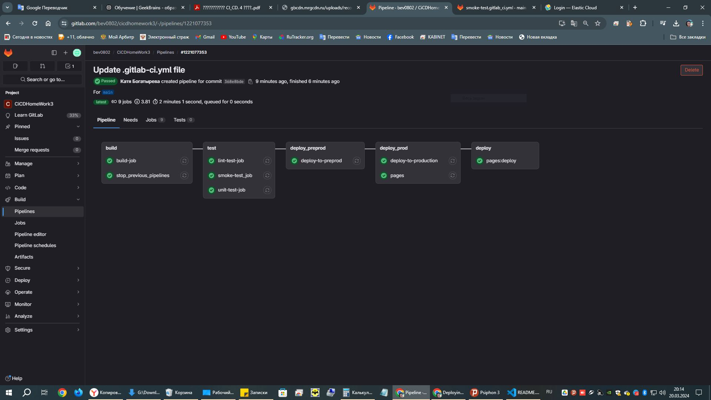
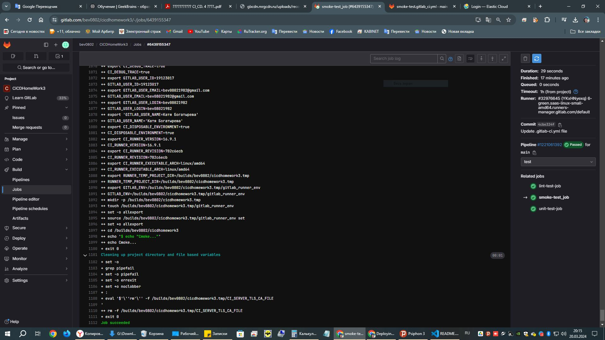

## Урок 4. Troubleshooting (диагностика и решение проблем в CI/CD)

<h3><span style="color: #C8A2C8;">Домашнее задание</h3></span>

Сделать отдельный репозиторий с шаблонами CI и подключить его к своему основному репозиторию через include.

<h3><span style="color: #C8A2C8;">Выполнила:</h3></span>

1. Cоздала отдельный репозиторий [templates](https://gitlab.com/bev0802/templates/-/tree/main)

2. В нем создала smoke-test.gitlab_ci.yml:

```.gitlab-ci.yml

smoke-test_job:
  script:
    - echo "Cmoke..."

```

3. В сновном репозитории [CiCDHomeWork3](https://gitlab.com/bev0802/cicdhomework3)
   в .gitlab-ci.yml добавила:

```.gitlab-ci.yml

#Подлючение внешних шаблонов
include:
 project: bev0802/templates  # Указывайть путь к проекту без https://gitlab.com/
 file: /smoke-test.gitlab_ci.yml
 ref: main

```

Успешный Pipelines


Отработка Cmoke

